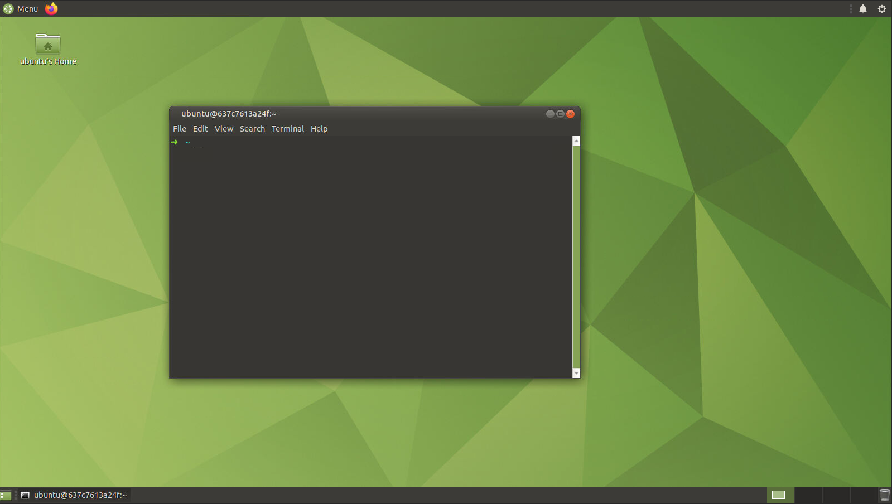

# Container gui images

## Intro

This repo use novnc with specify $PORT in env.

Terminator, htop are already installed.

Set $VNC_PASSWD to set password to vncserver

## Demo

Pull image and enjoy: https://hub.docker.com/r/anhdhbn/container-novnc-gui

```
docker pull anhdhbn/container-novnc-gui:ubuntu-xfce
```


```
docker pull anhdhbn/container-novnc-gui:ubuntu-mate
```

